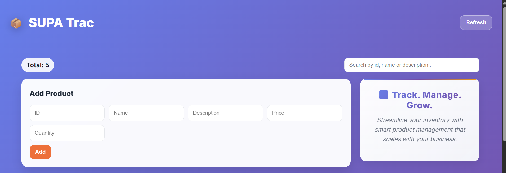
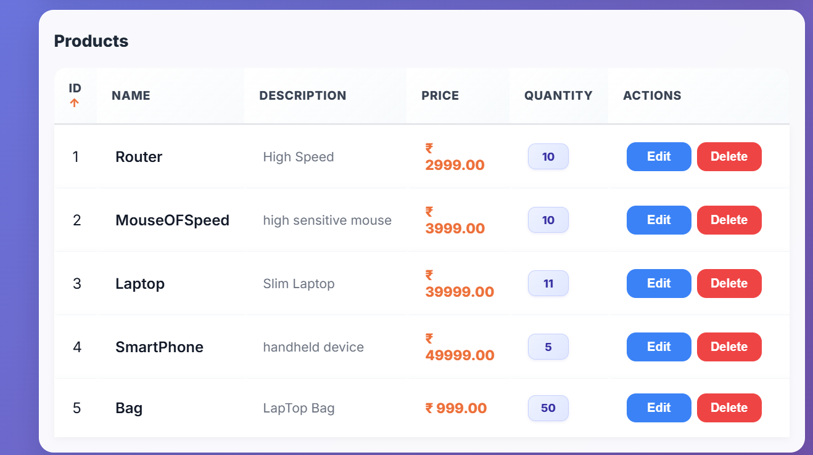

# 🚀 Product Management System


---

## 📌 Overview
A full-stack **Product Management System** built using:

- ⚡ FastAPI (Backend)
- 🎨 React (Frontend)
- 🗄️ PostgreSQL (Database)

This project performs full **CRUD operations** on products with a simple UI and fast API.

---

## ✨ Features
- ➕ Add new product  
- 📄 View all products  
- ✏️ Update product  
- ❌ Delete product  
- ⚡ Fast API responses  
- 🎯 Simple UI  

---

## 🛠️ Tech Stack

**Frontend:**
- React.js
- CSS

**Backend:**
- FastAPI
- Python
- SQLAlchemy

**Database:**
- PostgreSQL

---

## 📸 Screenshots

### Home Page


### Product Page

---

## 🚀 How to Run Project

### 🔹 Backend
```bash id="backend_run"
uvicorn main:app --reload

### 🔹 Frontend
cd frontend
npm install
npm start


FASTAPIPRACTICE/
│
├── main.py
├── models.py
├── database.py
├── frontend/
│   ├── src/
│   └── public/
└── README.md


🌐 API Endpoints
Method	Endpoint	Description
GET	/products	Get all products
POST	/products	Create product
PUT	/products/{id}	Update product
DELETE	/products/{id}	Delete product
